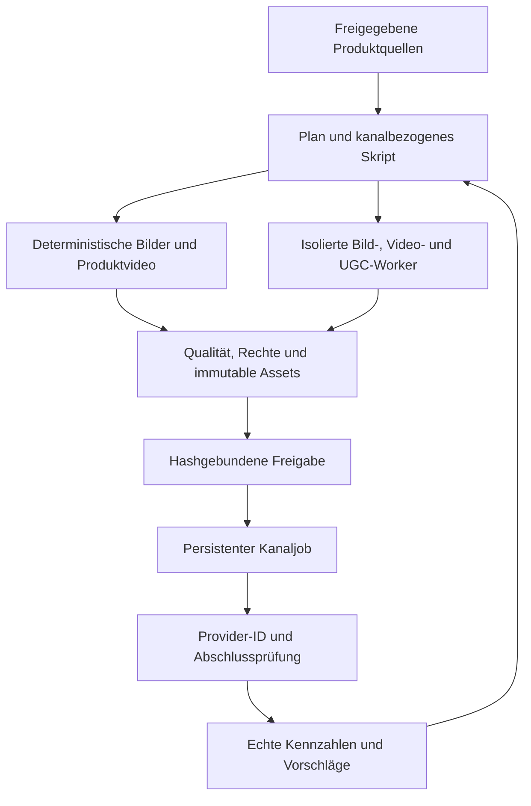

# Social Media Engine: Audit, Migration und KI-UGC
Stand: 2026-10-01 · documentVersion: 1.0.0 · Primary Domain: CAPITAL-AI-GROWTH

## Ergebnis und Prüfgrenze
Finance besitzt einen brauchbaren, modularen Unterbau für Social Content, deterministische Bilder/Shorts, Sprachverträge, Freigaben und echte Provideraufrufe. Eine durchgängig abgenommene generative Bild-/Video-/UGC-Produktion mit zuverlässiger automatisierter Verteilung ist durch die geprüften Quellen nicht belegt.

Diese Bewertung ist ein Quellcode- und Evidenzaudit. In dieser Sitzung wurden keine Originalbilder visuell bewertet, keine WAVs angehört, keine Videos abgespielt, keine Modelle ausgeführt und keine Social-Konten geprüft. Es werden deshalb keine MOS-, VBench-, FID-, Bildästhetik-, Engagement- oder Latenzwerte erfunden. Aussagen über Ergebnisse früherer Läufe sind Dokumentbefunde, keine erneute Runtime-Validierung.

Quellbaseline:
- capital-ai-online/Finance@dcef421fe6e350a3a2ade61d0299aad9ecca213c
- SvenKulessa/Capital-AI@2008cac17c8cabc98576d6b20a1ad56048c0028f
- Erster Lesestand e6247c8; vor Branch-Erstellung frisch gegen 2008cac korreliert. AGENTS.md, Domain-Governance, GROWTH/PROJECT und roadmapData.ts unverändert; dazwischen Dependency-Merge #64.
- AGENTS.md@main beider Repositories gelesen. Finance bleibt in dieser Sitzung unverändert.
- Zielrouting nach docs/governance/DOMAIN-RELEASE-GOVERNANCE.md: GROWTH federführend, PRODUCT für Studio/UX, PLATFORM für Worker/Broker/Storage, TRUST für Qualität/Sicherheit/Rechte, MARKET für Daten- und Claim-Rechte.
- Ziel-Main enthält Social-Links und Branding-Assets, aber keinen SocialMediaEngine-, socialMedia- oder scripts/media-Runtimepfad laut vollständigem Git-Tree. Social-Links sind keine Engine-Migration.
- Finance-Typkommentare und der ältere Architekturentwurf behaupten teilweise noch fehlende /generate-Implementierung. Der aktuelle Client und Router sowie textContentGeneration.ts belegen inzwischen Textgenerierung. Veraltete Kommentare sind keine aktuelle Statusquelle.

## Bewertungsmethode
Reifegrade beschreiben ausschließlich Implementierung und Nachweise:
0 = im geprüften Scope keine Umsetzung belegt; 1 = Entwurf/Vertrag; 2 = implementierter Teilpfad; 3 = technische Ergebnisnachweise dokumentiert; 4 = vollständige fachliche und produktive Abnahme.
Reifegrad 0 bedeutet hier keine belegte Fähigkeit, nicht schlechte Bildqualität. Die Grade werden nicht zu einer scheinpräzisen Gesamtnote gemittelt.

| Merkmal | Reife | Bewertung des belegten Zustands | Grenze / nächster Nachweis |
|---|---:|---|---|
| Branding-Karten / Thumbnails | 3 | Pillow erzeugt 1280×720, 1080×1080 und 1080×1920 mit Design-Tokens und Hashmanifest; Render-Smokes dokumentiert | Originaloutputs neu visuell prüfen: Layout, Lesbarkeit, Safe Areas, Logo |
| Generative Bilder / Bearbeitung | 1 | Providerentwurf vorhanden; geprüfter Renderer zeichnet deterministisch | Kein produktiver T2I/I2I-Adapter samt Modell-/Outputabnahme belegt |
| Deterministische Short-Videos | 3 | Pillow-Frames → FFmpeg; historischer 18-s-Smoke in 1080×1920 dokumentiert | Statische Szenenmontage; dokumentierter lokaler GPL-Build ist kein Production-Lizenznachweis |
| Video mit Voice-over | 2 | Lokale Audio-/Content-Hashes und Hörfreigabereferenz werden geprüft; AAC-Mux vorhanden | Abgenommener ca. 20-s-End-to-End-Fixture und tatsächliche A/V-Synchronität fehlen |
| Generatives Text-to-Video | 1 | Konzept und Storyboardfelder vorhanden | Kein geprüfter generativer Runtimepfad oder Benchmark |
| Generatives Image-to-Video | 1 | Providerneutral konzipierbar | Kein belegter Adapter/Output |
| KI-UGC / Avatar / Lip-sync | 0 | In gezielter UGC-Suche keine Implementierung gefunden | Synthetische Persona, Rechte, Stimme, Lip-sync, Kennzeichnung und Abnahme neu aufbauen |
| Social Copy / Skripte | 2 | Deterministische DE/EN-Vorlagen, Threads, Captions, Podcast-/Video-Outlines, Emoji- und Längenregeln | Begrenzte kreative Vielfalt; kein belegter quellengestützter LLM-Redaktionspfad |
| TTS / deutsche Finanzsprache | 3 technisch, fachlich gehalten | Qwen/Chatterbox-WAV- und ASR-Nachweise dokumentiert | Hörbericht: 1 PASS, 7 FAIL wegen abgehackter Sprache; P1 bleibt blockiert |
| Podcasts / mehrere Stimmen | 2 | Rollen-/Sprachverträge und Dialog-Outlines vorhanden | Kein abgenommener vollständiger Podcast-Export |
| Untertitel / Accessibility | 1–2 | ASR-Evidence vorhanden | Kein belegter Produktionspfad für korrigierte SRT/VTT, Timing und Safe Areas |
| Timeline / Editing UX | 2 | MediaProject v2, Undo/Redo, Import/Export, Vorschau, Canvas-Presets | Export ist JSON, nicht gerendertes MP4; Entwurf bleibt draft-only |
| Content-Provenienz / Freigabe | 2 | Kanonische Pakete, Metadatenhash und Single-use-Freigaben vorhanden | Approval Store in-memory; ausgelieferte Medienbytes nicht durch Approval-URL allein geschützt |
| Distribution | 2 | Echte YouTube/TikTok/Instagram/X/Facebook-Aufrufe im Code | Berechtigungen, aktuelle API-Verträge, zuverlässige Job-/Abschlussnachweise nicht abgenommen |
| Scheduling / Wiederanlauf | 1–2 | scheduledAt und Logzustände vorhanden | Im geprüften Router nur Logeintrag; kein zuverlässiger Scheduler-End-to-End-Nachweis |
| Analytics / Feedback | 2 | Publication-/Analytics-Evidenzvalidatoren bereits implementiert | Keine belegte vollständige Provider-Erhebung, persistente Verarbeitung oder Optimierung |
| Kosten / Betrieb | 2 | Begrenzte Renderer, getrennte Runtimepfade; Modal-Benchmark dokumentiert | Keine aktuellen €/accepted-asset-, VRAM-, p95- oder Kapazitätsmesswerte |

### Relevante Befunde
1. **TTS ist der bekannte Qualitätsengpass.** SOCIAL_P1_RUNTIME_ACCEPTANCE_2026-09-20.md enthält das spätere Hörupdate vom 22.09.: Nur Chatterbox-Beispiel 4 ist akzeptiert. ASR-PASS bestätigt keine natürliche Prosodie. Das spätere Remediation-Implementierungsdokument meldet HOSTED_RUNTIME_PENDING; daraus folgt kein neuer PASS. Rejected WAVs bleiben historisch, dürfen aber nicht in neue Shorts übernommen werden.
2. **Video-Encoderprofil ist noch kanalbezogen abzunehmen.** Der vorhandene Renderer nutzt MPEG-4 Part 2 plus AAC, nicht automatisch H.264. Die Wahl eines späteren H.264-Encoders erfordert Build-, Codec-/Lizenz- und Providerprüfung; libx264 darf nicht still das vorhandene GPL-Gate umgehen. 720P-Modellmaterial wird durch Skalierung auf 1080×1920 nicht zu nativem 1080P.
3. **Daueranpassung kann Audio abschneiden.** apad/atrim bindet Audio an die Videolänge. Es prüft nicht, ob letzter Satz/Disclaimer vollständig hörbar ist. Im geprüften ffprobe-Code werden Dimensionen, begrenzte Dauer und Audioanzahl geprüft; A/V-Drift, Clipping, Satzende und erwartete exakte Videodauer benötigen zusätzliche Tests.
4. **Hörfreigabe wird als Feld/Referenz konsumiert.** validate_voiceover_binding prüft PASS, Hash und Pflichttexte; es lädt keine signierte Hörentscheidung aus einem vertrauenswürdigen Store. In einer neuen API darf ein Nutzer durch gesetztes acceptanceStatus=PASS keine Abnahme selbst behaupten.
5. **Approval-URL ist keine Medienidentität.** computeContentHash bindet mediaUrl, aber keinen Hash der später abgerufenen Bytes. Mutable Inhalt an gleicher URL kann die Reviewbindung unterlaufen. Ziel: immutable Object-Version plus Asset-Hash; erneut unmittelbar vor Upload verifizieren.
6. **Freigaben sind flüchtig und vor Provideraufruf konsumiert.** In-memory-Zeilen gehen nach Neustart verloren. Bei Timeout oder Teilfehlern ist die Freigabe schon consumed. Für Scheduling: persistente Freigabe, transaktionale Jobreservierung, pro Kanal eindeutige Zustände, erneute Verifikation zum Sendezeitpunkt.
7. **scheduled ist kein Publication-PASS.** Der Router protokolliert geplante Jobs; außerdem wird providerseitig pending als scheduled abgebildet. Zielzustände trennen: QUEUED, UPLOADING, PROVIDER_PROCESSING, PUBLISHED, PARTIAL, FAILED, UNKNOWN. Ohne Provider-ID/Readback kein PUBLISHED.
8. **YouTube-Upload prüfen.** Der Adapter baut einen multipart-Body mit eigener Boundary, sendet im geprüften Aufruf aber keinen dazugehörigen Content-Type-Header. Vor Migration durch offiziellen multipart/resumable Contract und Integrationstest korrigieren. Keine bestätigte Live-Störung behauptet.
9. **TikTok-UX/Status prüfen.** privacy_level ist fest PUBLIC_TO_EVERYONE; creator_info/query und persistierte publish_id fehlen im geprüften Adapter. Die offizielle API verlangt eine zulässige creator-spezifische Option und liefert publish_id zur Statusverfolgung. Uploadannahme bedeutet nicht Veröffentlichung.
10. **Providerdrift ist offen.** Meta-Aufrufe verwenden v19.0. Unterstützung, Scopes, Creator-/App-Audit, Quoten und Medienanforderungen bei Umsetzung frisch gegen offizielle Dokumentation prüfen; die Quellcodeprüfung allein beweist keine aktuelle Nutzbarkeit.
11. **Thread-Semantik nicht zugesichert.** format=thread ist im Textvertrag möglich; generateTextContent erzeugt im geprüften X-Zweig weiterhin einen einzelnen Tweet. ScriptPackage enthält zusätzlich Thread-Outlines. Copy-Export, Thread-Publishing und Videos müssen als getrennte Fähigkeiten ausgewiesen werden.
12. **Inputtexte sind noch keine verifizierten Quellen.** topic/contextNote werden in Vorlagen eingebaut; ein Disclaimer ersetzt weder Fact Checking noch Claim-/Datenrechte. Numerische Aussagen benötigen konkrete Quelle, Zeitbezug, Berechtigung und unveränderte Bedeutung.
13. **Governance ist stärker als Ergebnisabnahme.** Viele Medien-Unit-Tests prüfen Quelltextfragmente. Diese sind hilfreich gegen bestimmte Drift, ersetzen aber keine ausgeführten Decoder-/Renderer-/Audio-/Provider-Negativtests. Keine pauschale Security- oder Qualitätsfreigabe aus grüner CI.
14. **Analytics-Verträge bereits wiederverwenden.** publicationAnalyticsEvidence.ts und entsprechende Unit-Tests existieren. Die ältere Roadmap-Aussage über fehlende kanonische Semantik ist damit zu eng; Erhebung/Persistenz/Feedback bleiben gesonderte Lücken.
15. **Runtime-Migration statt Kopie.** Finance-Client nutzt Supabase-authFetch und Owner/Founder-Entitlement. Capital-AI verwendet ZITADEL. OAuth-Tokens, Nutzer-IDs und produktive Freigaben dürfen nicht kopiert oder allein über gleiche E-Mail verknüpft werden.

## Zielarchitektur
Produktziel: Ein verifizierter Website-/Release-Inhalt wird als Artikel, Social-Post, Bild, 20–45-s-Produktvideo oder transparent gekennzeichneter synthetischer Presenter-Clip vorbereitet; freigegebene Pakete werden kanalbezogen verteilt und anhand echter Ergebnisse verbessert.

- Express-Gateway: ZITADEL-Authentifizierung, echte serverseitige Rollen, Größenlimits, Rate Limits, kanalbezogene Berechtigungen. Normale Abonnenten erhalten nicht automatisch Social-Adminrechte.
- Interne FastAPI-Media-Worker: getrennt nach CPU-Rendering und GPU-Inferenz; kein Zugriff auf Social-OAuth, GitHub, Stripe oder Render-Control-Plane. Typisierte, versionierte Requests/Results; TypeScript am Node-/Frontend-Vertrag, Python intern.
- NATS JetStream: Jobs/Ereignisse über vorhandene Infrastruktur, eindeutige Job-/Content-/Asset-/Channel-IDs, Ack nach dauerhafter Verarbeitung, Backpressure und Dead-letter-Verfahren. Redelivery ist kein exactly-once-Publishing.
- Valkey: Cache, kurzlebige Locks/Rate Limits; kein alleiniger dauerhafter Approval-/Job-/Asset-Evidence-Store.
- Persistenter Store plus Outbox und Object Storage: erst gegen tatsächlich vorhandene Capital-AI-Storageverträge auswählen. JetStream/Valkey ersetzen nicht automatisch relationale Transaktionen oder revisionsgebundene Assetverwaltung. Keine neue Datenbank provisioniert.
- Publisher: genau ein autorisierter Pfad je Plattform. Vor jedem Upload Inhalt, Bytes, Rechte, Freigabe, Kanal und Ablaufdatum erneut prüfen. Bei unbekanntem Providerergebnis erst Status abgleichen, nicht blind erneut senden.
- Ergebnisse auf Website nur nach Assetabnahme ausliefern; keine ungeprüften Generierungen direkt in produktive Hero-/Branding-Pfade.
- GPU-Modelle gehören nicht in den kleinen Webservice. Hardware/Hosting ist ungeklärt; ohne genehmigte Ressource bleibt die betreffende Fähigkeit gehalten.
- Produktionspromotion wie bisher über attestierten GHCR-Digest, SBOM, Modell-/Asset-Lizenznachweise und Runtime-Identität.

### KI-UGC-Scope
1. Erste Stufe: Screen-recording/echte Produktansichten plus Script, Voice-over, Untertitel und CTA. Geringere Identitätsrisiken und direkt nachvollziehbarer Produktbezug.
2. Zweite Stufe: eigenständige synthetische Persona oder ausdrücklich freigegebener Darsteller; stabile Persona-/Voice-ID, Referenzbild-/Audiohash, schriftliche Nutzungsgrundlage, Ablauf und Widerruf.
3. MuseTalk ist ein Lip-sync-Kandidat, kein vollständiger Text-to-Video-/UGC-Generator. Inputvideo, Stimme, Consent und Postproduktion bleiben eigene Komponenten.
4. Keine erfundenen Kundenerfahrungen, Testimonials, Profitnachweise, Zertifikate oder Live-Screenerwerte. Eine synthetische Moderatorin darf Funktionen erklären, aber keine echte Nutzererfahrung vorspiegeln.
5. KI-Herkunft sichtbar und in Assetmanifest/kanalbezogenen Metadaten abbilden. Konkrete Plattform- und rechtliche Anforderungen vor Veröffentlichung frisch prüfen; C2PA beweist weder Wahrheit noch Nutzungsrechte.
6. Finanzdaten bleiben an MARKET-Rechte/Freshness gebunden. Für den ersten Pilot reine Produkt-/Lerninhalte mit freigegebenen Screenshots verwenden.

## Open-Source-Auswahl pro Skillkomponente
Alle Angaben sind recherchierte Kandidaten vom 01.10.2026, keine Installations-/Security-/Redistribution-Freigabe. Code, Gewichte, Encoder, Zusatzmodelle, Fonts, Musik, Stockmaterial und Outputrechte sind getrennte Inventare. Lizenzkostenfreiheit bedeutet nicht kostenfreien GPU-, Storage-, API- oder Hostingbetrieb.

| Skillkomponente | Bestehender Ansatz | OSS-Erweiterung / Alternative | Einsatzentscheidung und Prüfgrenze |
|---|---|---|---|
| Quellen-/Claim-Aufbereitung | topic/contextNote, Paketprovenienz | vorhandene Zod-Verträge + quellengebundene Regeln; promptfoo für Negativ-/Redaktionsfixtures | Keine neue autonome Webrecherche als Wahrheit; Prompt-Test-Ergebnisse sind kein Fact Check |
| Copywriting / Hook / CTA / Lokalisierung | feste DE/EN-Vorlagen | llama.cpp (MIT) + separat lizenzgeprüftes deutschfähiges Instruct-Modell | Optionaler lokaler Adapter, deterministische Vorlagen behalten; keine erfundenen Viral-/Retention-Scores |
| T2I / Thumbnails | Pillow-Karten | FLUX.2 klein 4B und 4B Base (Apache-2.0); FLUX.1 schnell als Vergleich | 4B-Pilot; 9B und dev nicht pauschal kommerziell freigeben; Zahlen/Logo/Text weiterhin deterministisch |
| Bildbearbeitung / konsistenter Look | keine belegte generative API | FLUX.2 klein 4B Multi-reference Editing + Diffusers (Apache-2.0 Code) | Referenz-/Masken-/Outputbindung; keine automatische Ersetzung produktiver Assets |
| Workflow-Authoring | eigenes Manifest | ComfyUI (GPL-3.0) für kuratierte lokale Workflows | Optional isoliert; keine ungeprüften Custom Nodes, Manager-Autoinstallationen oder beliebigen Workflow-Uploads |
| Datenvisualisierung | Branding-Karten / D3-Planungsadapter | Vega-Lite (BSD-3-Clause), bestehende D3-/Chartverträge | Exakte Werte/Quellen deterministisch; PNG/SVG-Export für Video |
| Produkt-Screen-capture | nicht migriert | Playwright (Apache-2.0) | Erst mit freigegebener Fixture-/Testidentität; keine Session-/PII-/Kontostand-Leaks |
| Motion / 3D / Branding-Animation | statische Framefolge | Blender (GPL) als separater Headless-Worker | Optional für Intros/Erde; Asset-/Fontlizenzen separat; Renderbudget begrenzen |
| TTS / Stimmen / Podcasts | Qwen/Chatterbox-Vertrag | Chatterbox V3 (MIT Code) zunächst reparieren; Qwen3-TTS als vorhandenen Kandidaten neu prüfen | Akzeptierte Stimme gegen Beispiel 4; Code-/Checkpointlizenz und deutsches Hörbenchmark sind Pflicht |
| ASR / Zahlenprüfung | Whisper-Evidenzharness | faster-whisper (MIT) | Wiederverwenden/vereinheitlichen; Required-Term-Prüfung plus Satz-/Zahlenkontrolle |
| Captions / Alignment | kein abgenommener Export | WhisperX (BSD-2-Clause) und FFmpeg/libass nach Buildprüfung | Alignment-/Diarization-Modelle separat prüfen; SRT/VTT plus visuelles Timing |
| T2V / I2V / B-roll | Entwurf | Wan2.2 TI2V-5B (Apache-2.0 laut Upstream) via Diffusers | Priorisierter generativer Pilot; offizielles Beispiel benötigt mindestens 24 GB VRAM, Auflösung 1280×704/704×1280; keine eigene Messung |
| Speech-to-Video / Character Motion | fehlt | Wan2.2 S2V-14B / Animate-14B | Späterer Benchmark, größeres Modell-/Hardwarebudget, Rechte an Referenzbewegungen separat |
| UGC / Lip-sync | fehlt | MuseTalk (MIT Code) | Nur eigener/erlaubter Presenter; Upstream-Testdaten nicht kommerziell; zusätzliche Gesichts-/Posemodelle und Gewichte vollständig prüfen |
| Schnitt / Encoding / Loudness | Pillow/FFmpeg | vorhandenen FFmpeg-Worker erweitern, optional Blender | Kein zweiter Publisher; Buildprofil-/Codecprüfung, LUFS/True Peak, Captions, Safe Areas |
| Komplett-Short-Orchestrierung | eigene Engine | MoneyPrinterTurbo (MIT Code) als Referenz / begrenzter Rendereradapter | Keine Übernahme seiner Publisher/Credentials; angeschlossene Stock-/TTS-/LLM-Dienste sind nicht automatisch kostenlos |
| Provenienz / Supply Chain | SHA-256-Manifeste | contentauth/c2pa-rs (MIT/Apache-2.0) plus bestehende SBOM/Scanner | C2PA zusätzlich zum Manifest; Transcodierung kann Metadaten entfernen, Sidecar-Nachweis erhalten |
| Video-/Prompt-QA | Quelltextchecks, ASR | VBench (Apache-2.0 Code), VMAF (BSD+Patent), promptfoo nach Paketprüfung | VBench für generative Kohärenz; VMAF nur gegen saubere Referenz für Encodingverlust; keine Qualitätsnote ohne Messung |
| Planung / Kalender / Distribution | Finance-Publisher und Log | Postiz OSS (AGPL-3.0) als Evaluationsalternative; bestehende NATS-Jobs bevorzugen | Make-or-buy-Gate; genau einen Publisher auswählen, keine parallelen Tokenstores; App-Audit/Providerrechte bleiben erforderlich |
| Analytics / Attribution | Evidence-Schemas | Umami (MIT) für Website-Konversion + offizielle Social-Metriken | Website-Analytics ersetzt keine Social-Retention; Quellen/Fenster und Datenschutz getrennt |
| Zuverlässigkeit / Monitoring | begrenzte Jobs | bestehende JetStream-/Valkey-/Observability-Verträge | Kein zusätzlicher Workflow-Cluster als Pilotvoraussetzung; bounded Retry und Dead-letter |

Primärquellen stehen im maschinenlesbaren research-candidates.json neben diesem Bericht. Qwen3-TTS-Upstream konnte über den Webreader nicht zuverlässig geöffnet werden; der Code-/Checkpoint-Lizenzstand bleibt ausdrücklich zu prüfen, statt Apache-2.0 aus anderen Qwen-Modellen zu übertragen.

Nicht als kostenfreie OSS-Baseline wählen:
- Remotion ohne Prüfung seiner aktuellen kommerziellen Bedingungen; source-visible bedeutet nicht uneingeschränkt OSS/kostenfrei.
- LTX-Video/LTX-2 ohne exakte Varianten-/Gewichtslizenzprüfung; verschiedene Generationen tragen verschiedene Bedingungen.
- beliebige Community-LoRAs, Gesichtserkennungspakete, Stockclips oder Musik aufgrund eines Repository-Lizenzlabels.
- Hosted „free tiers“ als Garantie für dauerhaft kostenfreien automatisierten Betrieb.

### Aufnahmegate für jeden Kandidaten
1. Offizielles Repository, Maintainer-Namespace, stabiler Release/Commit und erwartete Funktion.
2. Artefakt-/Registryhash, Signatur/Provenance soweit verfügbar, gesamte transitive Abhängigkeiten und Install-Skripte.
3. Advisories/OSV/CVE sowie offizielle Issues/Discussions/Releasehinweise auf Takeover, kompromittierte Releases und Regressionen.
4. Code-/Model-/Dataset-/Asset-/Output-/Redistribution-Lizenzen und NOTICEs separat; keine Blanket-Approval.
5. Kompatibilitäts-, Qualitäts-, Budget- und Negativtests gegen den exakten Container-/Checkpoint-Digest.
Diese Recherche führt dieses Aufnahmegate noch nicht für alle Kandidaten aus. Die neueste stabile Version wird erst danach gepinnt. Installation und GPU-Jobs sind noch offen.

## Qualitätsabnahme: vorgeschlagener Benchmark
Vorgeschlagene Pilotziele; keine gemessenen Resultate:
- 12 freigegebene Produkt-/Lernbriefs: Feature-Erklärung, Navigation, Konto ohne PII, Roadmap, Lizenzzentrum, Methoden-/Risikoerklärung; DE zuerst.
- Pro Brief eine deterministische Bildkarte, drei Bildvarianten und ein 20–45-s-Short; mindestens drei unterschiedliche Seeds für generative Varianten.
- Drei UGC-Skripte mit synthetischer Persona; dieselben Inhalte als Screen-capture-Referenz. Reale Person erst mit überprüfter Freigabe.
- Relevante Sachbehauptungen und alle Zahlen/Assetnamen/Disclaimer korrekt; fehlende Quellen oder Zustimmung = DENY.
- Bildrubrik 1–5: Brief-Treue, visuelle Artefakte, Branding, Lesbarkeit auf Mobilgerät, Komposition, Varianz. Ziel Median ≥4 und kein kritischer Fehler.
- TTS-Hörreview: Prosodie, Kontinuität, Timbre, Aussprache, Tempo/Emotion; Ziel Median ≥4, alle erforderlichen Finanzbegriffe/Zahlen korrekt. Kein MOS ohne dokumentiertes Panel/Protokoll.
- Video: kohärente Bewegung/Identität, kein störendes Flicker/Uncanny Face; passender Ausschnitt, Untertitel, vollständig hörbares Satzende. Ziel A/V-Abweichung ≤80 ms und Caption-Timingabweichung ≤150 ms, zu messen.
- Audio als Pilotstart: −16 LUFS ±1 und True Peak ≤−1 dBTP; kanalbezogen verifizieren, kein universeller Plattformstandard behauptet.
- ffprobe-/Decode-Test: erwartete Streams, Framerate, Dauer, Seitenverhältnis, Pixelformat und Codec nach Kanalprofil; Metadata entfernen/Sidecar erhalten nach Policy.
- VBench-Maße nur für passende generative Aufgaben; CLIP-Ähnlichkeit ist keine Faktentreue. FID/FVD nicht auf wenigen Pilotclips als belastbare Populationsergebnisse ausgeben.
- Kosten: p50/p95 Renderzeit, Peak-VRAM/RAM, Retries, accepted-output-Rate, €/accepted-asset und Speicher/Transfer; aus echten Läufen messen.
- Distribution: Tokenablauf, Quoten, Auditrestriktionen, Crash vor/nach Upload, Timeout mit unbekanntem Ergebnis, Teilfehler, doppelte Zustellung, Widerruf und Rate-Limit testen.
- Wirkung: reale 3-s-Holdrate, Watchtime, Completion, CTR, Website-Konversion und Beschwerden je Plattform/Fenster. Kein „viralPotentialScore“ oder prognostizierte Retention als gemessene Kennzahl.
- Interner Qualitätsentscheid kombiniert Messungen und Human Review. Rechtliche Freigaben werden nicht aus einer hohen Qualitätsnote abgeleitet.

## Migrationsplan und verbindliche Roadmap-Kennungen
Kanonische Arbeitspakete stehen in src/data/socialContentRoadmap.ts und werden durch src/data/roadmapData.ts in die bestehende Control-Center-Roadmap übernommen. Dieser Bericht spezifiziert Umfang/Abnahme, erzeugt keinen zweiten Statusregister.

| Reihenfolge / ID | Primary / Mitwirkung | Umsetzung | Abhängigkeit | Exit-Evidenz |
|---|---|---|---|---|
| 1 · CA-GROWTH-SOC-MIGRATION | GROWTH / alle | Audit, Quellenmanifest, Scope und Paketabgleich; Finance SOCIAL-P0/P1/P2/P3 zuordnen | aktuelle Main-/Writer-Korrelation | Report/Recherche/Roadmap in Review; Runtime-Migration bleibt offen |
| 2 · CA-TRUST-SOC-RIGHTS | TRUST / GROWTH, MARKET | Code-/Gewichte-/Assets-/Daten-/Voice-/Persona-Rechte, Kennzeichnung, Reklame-/Referralregeln | 1 | Individuelle erlaubte Verwendungen, fehlende Rechte als DENY, schriftliches Persona-/Voice-Register |
| 3 · CA-PLATFORM-SOC-FOUNDATION | PLATFORM / TRUST | versionierte Contracts, persistente Jobs/Outbox/Assets, ZITADEL-Rollen, Tokenverschlüsselung, idempotenter Transport | 1, 2 | echte Neustart-/Redelivery-/Tenant-/SSRF-/Budgettests; keine Supabase-ID-Kopie |
| 4 · CA-GROWTH-SOC-COPY | GROWTH / MARKET, TRUST | freigegebene Website-/Releasequellen, Kanalskripte, Fakt-/Zahlen-/Disclaimerprüfung | 2, 3 | 12 Brief-Fixtures, Quellentreue und Grenzfalltests |
| 5 · CA-PLATFORM-SOC-MEDIA | PLATFORM / PRODUCT, TRUST | Pillow/FFmpeg sauber portieren, Fonts/Tokens, Website-Capture, Bilder, Captions, Audioqualität | 3, 4 | CPU-Pilot mit immutable Outputs, Decoder-/Buildprofilprüfung |
| 6 · CA-GROWTH-SOC-TTS | GROWTH / PLATFORM, TRUST | Chatterbox-Prosodie, Qwen-Vergleich, Voice-Personas, Finanzglossar | 2, 3, 4 | DE-Benchmark plus Hör-PASS gegen Beispiel 4; neue immutable WAVs |
| 7 · CA-PLATFORM-SOC-GENVIDEO | PLATFORM / GROWTH, TRUST | FLUX-4B/Wan-Adapter, GPU-Pool, B-roll/T2V/I2V, Budget-/Timeoutlimits | 2, 3, 5 | tatsächliche Hardwarefreigabe, Benchmark, gepinnte Gewichte/OCI-Digests |
| 8 · CA-PRODUCT-SOC-STUDIO | PRODUCT / GROWTH, TRUST | deutschsprachige Redaktion, Vorschau, Quellen-/Rechte-/Kostenanzeige, Assetvergleich, Freigabe/Widerruf | 3, 4, 5 | Mobile/Desktop und Rollen-/Cross-tenant-Tests; kein JSON-Export als Video-Render |
| 9 · CA-GROWTH-SOC-UGC | GROWTH / PRODUCT, PLATFORM, TRUST | synthetischer Presenter + MuseTalk/Voice + Produktdemo; sichtbare KI-Herkunft | 2, 5, 6, 7, 8 | drei bewertete Clips, Persona-/Voice-Rechte, Lip-sync-/Audio-/Claim-PASS |
| 10 · CA-PLATFORM-SOC-DISTRIBUTION | PLATFORM / GROWTH, TRUST | Publisher portieren/korrigieren, kanalbezogene Freigabe, Scheduler, Statuspoller, Dead-letter | 2, 3, 5, 8 | provider-konformer Test/Pilot, persistierte IDs, echte Abschlussprüfung, Retry ohne Doppelpost |
| 11 · CA-GROWTH-SOC-PILOT | GROWTH / alle | automatisierte Produktion und freigegebene Verteilung, Messung/Optimierung | 4, 5, 6, 8, 10; UGC-Pilot zusätzlich 9 | beobachtete Ergebnisse und Kosten, drei erfolgreiche Wiederanlauf-/Validierungszyklen, Rollback |

Distribution für einfache geprüfte Text-/Bild-/Produktvideo-Pakete muss nicht auf generatives Video/UGC warten. UGC bleibt ein separater Freigabekorridor. Ein Fahrplan ist keine aktuelle Production-Abnahme.
AP-SOC-01/02/03 betreffen Telegram-Alerts, Share-Links bzw. Discord; sie werden nicht als Ersatz für diese Engine-Migration markiert.
AP-OPS-FINANCE-OFF erhält die Migration als zusätzliche Abhängigkeit: Finance erst suspendieren, wenn benötigte Social-Funktionen, Konto-/Tokenzugriff, historische Nachweise und Rückweg abgenommen sind.
Für Kopien: blob-/SHA-256-Manifest pro Datei, jeweilige Ursprungslizenz erhalten, passende neue Auth-/Storage-Verträge implementieren. Alte runtime-/legacy-Adapter nicht in Capital-AI mounten.

### Automatisierungsstufen
A. Automatische Recherche-/Produktquellenaufnahme und Entwurfserstellung innerhalb zugelassener Quellen und Ressourcen.
B. Automatisches Rendering/QA, sobald exakte Adapter/Gewichte/Rechte/Budget freigegeben sind.
C. Automatisierte Verteilung eines konkret freigegebenen immutable Pakets über geprüfte Providerverträge; erneute Abnahme bei geändertem Text, Bytes, Persona, Musik oder Kanal.
D. Eine zukünftige Kampagnenfreigabe kann begrenzte Vorlagen, Kanäle, Gültigkeit, Stückzahl, Budget und Abbruchregeln enthalten. Sie ist erst nach explizitem Contract-/TRUST-/Owner-Review aktiv; bestimmte Plattformen verlangen zusätzliche Creator-Interaktion.
Kein Agent darf anhand eigener QA-Note eine Publikationsfreigabe erzeugen. Diese Sitzung erteilt keine pauschale Erlaubnis für zukünftige öffentliche Posts und richtet keine Konten ein.

### Cutover und Rückweg
- Canary: Produktion zuerst draft-only, ein reproduzierbares Produktvideo und intern zugängliche Assetvorschau.
- Danach owner-freigegebener kanalbezogener Pilot; Provider-ID und sichtbaren Endzustand prüfen.
- Konto-Neuautorisierung und Redirect-URIs nach neuem ZITADEL-/Domainvertrag; Secretwerte nie in Report/Client. Historische Finance-Evidence read-only erhalten.
- Publisher-Lock pro Content/Kanal; Finance und Capital-AI senden nie denselben Job parallel.
- Rückweg: neue Scheduler/Worker deaktivieren, ungesendete Jobs halten, bekannte freigegebene Digests nutzen. Bei UNKNOWN erst Providerstatus prüfen. Finance-Zugriff bleibt bis Abnahme.
- Keine DNS-, Billing-, Production-, OAuth-, Broker- oder GitHub-Rule-Mutation durch diesen Plan.

## Self-Healing mit fünf Validierungsschritten
1. DETECT: z. B. Prosodieabbrüche, A/V-Drift, Modell-/Lizenzdrift, Tokenablauf oder Provider-Timeout.
2. CORRELATE: Main-SHA, OCI-/Checkpoint-/Template-/Assethash, Job, Rechte und Kanalresultat verbinden.
3. CLASSIFY: transienter Fehler, Inhaltsfehler, Rechteproblem, Identitäts-/Sicherheitsproblem oder UNKNOWN-Publikation.
4. REMEDIATE: nur begrenzt/reversibel; z. B. Render aus unverändertem freigegebenem Input wiederholen oder Job halten. Keine Freigabe lockern, Person ersetzen, Fakten verändern oder unknown Upload blind wiederholen.
5. VERIFY: identischer zugelassener Inhalt, QA/Rechte, Runtimeidentität und Provider-Endzustand. Fehlversuch eskalieren; Muster erst nach mindestens drei unabhängigen positiven Zyklen als automatische Invariante verankern.
Historischer 1-von-8-Hörtest ist ein Fehlermuster, kein neuer erfolgreicher Selbstheilungszyklus.

## Primäre Repository-Evidenz
- [server/socialMedia/textContentGeneration.ts](https://github.com/capital-ai-online/Finance/blob/dcef421fe6e350a3a2ade61d0299aad9ecca213c/server/socialMedia/textContentGeneration.ts)
- [server/socialMedia/contentApproval.ts](https://github.com/capital-ai-online/Finance/blob/dcef421fe6e350a3a2ade61d0299aad9ecca213c/server/socialMedia/contentApproval.ts)
- [server/socialMedia/platformPublishers.ts](https://github.com/capital-ai-online/Finance/blob/dcef421fe6e350a3a2ade61d0299aad9ecca213c/server/socialMedia/platformPublishers.ts)
- [src/routes/socialMediaRoutes.ts](https://github.com/capital-ai-online/Finance/blob/dcef421fe6e350a3a2ade61d0299aad9ecca213c/src/routes/socialMediaRoutes.ts)
- [server/socialMedia/publicationAnalyticsEvidence.ts](https://github.com/capital-ai-online/Finance/blob/dcef421fe6e350a3a2ade61d0299aad9ecca213c/server/socialMedia/publicationAnalyticsEvidence.ts)
- [scripts/media/capital_ai_media.py](https://github.com/capital-ai-online/Finance/blob/dcef421fe6e350a3a2ade61d0299aad9ecca213c/scripts/media/capital_ai_media.py)
- [scripts/media/render_content_assets.py](https://github.com/capital-ai-online/Finance/blob/dcef421fe6e350a3a2ade61d0299aad9ecca213c/scripts/media/render_content_assets.py)
- [src/platform/SocialMediaEngine/types.ts](https://github.com/capital-ai-online/Finance/blob/dcef421fe6e350a3a2ade61d0299aad9ecca213c/src/platform/SocialMediaEngine/types.ts)
- [MediaStudio.tsx](https://github.com/capital-ai-online/Finance/blob/dcef421fe6e350a3a2ade61d0299aad9ecca213c/src/features/social/ui/MediaStudio/MediaStudio.tsx)
- [TTS-Runtime und Hörupdate](https://github.com/capital-ai-online/Finance/blob/dcef421fe6e350a3a2ade61d0299aad9ecca213c/docs/social-media/CAPITAL-AI-SOCIAL/reports/SOCIAL_P1_RUNTIME_ACCEPTANCE_2026-09-20.md)
- [P1-Remediation](https://github.com/capital-ai-online/Finance/blob/dcef421fe6e350a3a2ade61d0299aad9ecca213c/docs/social-media/CAPITAL-AI-SOCIAL/work-packages/SOCIAL_P1_PROSODY_REMEDIATION_2026-09-22.md)
- [OPS-Remediation-Evidence](https://github.com/capital-ai-online/Finance/blob/dcef421fe6e350a3a2ade61d0299aad9ecca213c/docs/projects/operations/evidence/OPS_SOCIAL_P1_PROSODY_REMEDIATION_IMPLEMENTATION_2026-09-22.md)
- [P2-Voiceover](https://github.com/capital-ai-online/Finance/blob/dcef421fe6e350a3a2ade61d0299aad9ecca213c/docs/social-media/CAPITAL-AI-SOCIAL/work-packages/SOCIAL_P2_VOICEOVER_INTEGRATION_2026-09-20.md)
- [Render-Smoke-Evidence](https://github.com/capital-ai-online/Finance/blob/dcef421fe6e350a3a2ade61d0299aad9ecca213c/docs/evidence/media/OPEN_SOURCE_MEDIA_RENDERING_2026-08-19.md)
- [Aktuelle Social-Roadmap mit älteren Statuszeilen](https://github.com/capital-ai-online/Finance/blob/dcef421fe6e350a3a2ade61d0299aad9ecca213c/docs/social-media/CAPITAL-AI-SOCIAL/ROADMAP.md)
- [YouTube Uploadvertrag](https://developers.google.com/youtube/v3/docs/videos/insert)
- [TikTok Direct Post](https://developers.tiktok.com/doc/content-posting-api-reference-direct-post)

## Metricool MCP Vorintegration — 2026-10-06

CURRENT_MAIN für diese Vorintegration: `5f333bcd5e219ae160a611941ba1e9fde01f4c94`.

- Der offizielle Metricool-MCP-Endpunkt `https://ai.metricool.com/mcp` wird repositoryseitig als externer HTTP-MCP in `.mcp.json` registriert.
- Die Anbindung bleibt **Operator-/Control-Plane-only**. Sie wird nicht in den öffentlichen Web-Runtime-Bundle, Server-Runtime oder einen autonomen Publisher eingebaut.
- Authentifizierung erfolgt über Metricool OAuth im jeweiligen MCP-Client. Tokens, API-Keys und Sessiondaten dürfen nicht im Repository stehen.
- Metricool MCP ist laut aktueller Metricool-Dokumentation auch im Free-Tarif verfügbar. Die Free-Tariflimits gelten unverändert.
- Die separate Metricool REST API ist laut aktueller Metricool-Dokumentation nur für Advanced/Custom verfügbar und wird deshalb unter der CAPITAL-AI-No-Cost-Grenze **nicht** integriert.
- Für die kommende Social Media Engine dient Metricool zunächst als optionaler, provider-neutral abgegrenzter Operator-Adapter. Vollautomatische serverseitige Veröffentlichung über Metricool bleibt gehalten, solange dafür kostenpflichtiger API-Zugriff erforderlich wäre.
- Ein späterer Wechsel auf Metricool API, White-Label oder serverseitige Integration ist eine eigenständige Kosten-/Provider-/Security-Entscheidung und darf nicht durch diese MCP-Registrierung impliziert werden.

