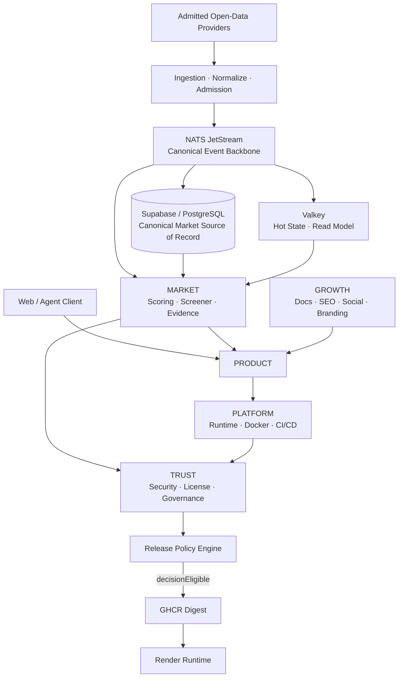
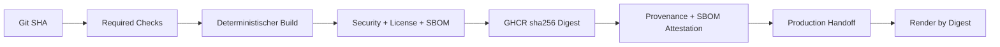
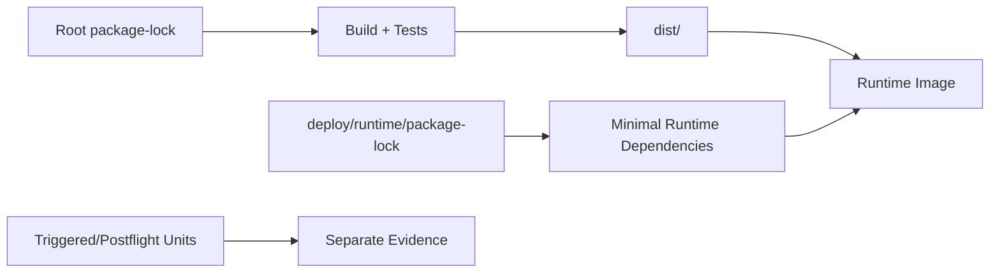

<p align="center">
  
</p>

<h1 align="center">CAPITAL-AI</h1>

<p align="center">
  Multi-Asset Market Intelligence · Evidence-first Architecture · Secure Software Supply Chain
</p>

<p align="center">
  <a href="https://github.com/SvenKulessa/Capital-AI/actions/workflows/build-security.yml"></a>
  <a href="https://github.com/SvenKulessa/Capital-AI/pulls"></a>
  <a href="https://github.com/SvenKulessa/Capital-AI"></a>
</p>

> **Release-Hinweis:** Dieses Repository befindet sich im evidenzgebundenen Aufbau. Ein erfolgreicher Test, Build oder Security-Scan ist allein **keine** Lizenz-, Security- oder Production-Freigabe.

## Inhaltsverzeichnis

- [Über CAPITAL-AI](#über-capital-ai)
- [Architektur](#architektur)
- [Domänen](#domänen)
- [Entwicklung](#entwicklung)
- [Supply Chain](#supply-chain)
- [Dependency Boundaries](#dependency-boundaries)
- [Security und Evidence](#security-und-evidence)
- [Dokumentation](#dokumentation)
- [Sponsoring und Forschung](#sponsoring-und-forschung)
- [Status und Grenzen](#status-und-grenzen)

## Über CAPITAL-AI

CAPITAL-AI ist eine in Entwicklung befindliche Multi-Asset-Market-Intelligence-, Scoring- und Screening-Plattform. Ziel ist die nachvollziehbare Verbindung von Marktdaten, Scoring, Pipeline-Konfiguration, Evidence und sicherem Deployment für private, research-orientierte und professionelle Nutzung.

Produktive Marktdaten, Providerrechte, Scoring-Eligibility und Release-Freigaben bleiben fail-closed. Demo-, geschätzte oder unbelegte Daten gelten nicht als produktive Evidence.

## Architektur



### Canonical Market Data Flow

NATS JetStream ist der kanonische Event-Backbone. Erst nach einem bestätigten JetStream-Ack wird ein Market-Fact in die persistente PostgreSQL/Supabase-Ablage übernommen. Valkey enthält ausschließlich regenerierbaren Hot State und ist weder Source of Record noch Evidence-Authority. MARKET darf Cache-Daten nur verwenden, wenn die zugehörige durable Evidence verifizierbar ist.

```text
Provider → Admission → NATS JetStream
                     ├─→ Canonical PostgreSQL/Supabase
                     ├─→ MARKET Scoring/Screener
                     └─→ Valkey Hot State
```

`scoreEligible` ist eine Market-Data-/Scoring-Zulassung und bleibt von `decisionEligible` getrennt. `decisionEligible` gehört zum Release-/Policy-Pfad und darf nicht aus einem erfolgreichen Score oder verfügbaren Cache abgeleitet werden.

### Build-once / Promote-many



## Domänen

| Domain | Verantwortung |
|---|---|
| **CAPITAL-AI-PRODUCT** | Frontend, Agent Client, UX, Konto und Profil |
| **CAPITAL-AI-MARKET** | FinTech, Provider, Scoring, Screener und Market Data |
| **CAPITAL-AI-PLATFORM** | Render, Docker, NATS, Valkey, CI/CD und Observability |
| **CAPITAL-AI-TRUST** | Security, Compliance, Governance, QA, Lizenz und Provenance |
| **CAPITAL-AI-GROWTH** | Dokumentation, SEO, Social, Branding und Veröffentlichung |

Der verbindliche Einstiegspunkt für Engineering- und Agent-Arbeit ist [AGENTS.md](AGENTS.md).

## Entwicklung

```sh
npm ci --ignore-scripts
npm run preflight:full
```

Für einen lokalen Build:

```sh
npm run lint
npm test
npm run build
npm run verify:browser
```

Build-/Test-Erfolg ersetzt keine Production-Freigabe.

## Supply Chain

CAPITAL-AI verfolgt einen Evidence-first-Releasepfad:

- Actions auf Commit-SHAs pinnen.
- Base Images auf Version **und Digest** pinnen.
- Lockfiles deterministisch installieren.
- Install-Skripte standardmäßig deaktivieren.
- Source-, Build- und Runtime-Scans getrennt behandeln.
- SBOM und Provenance an den exakten Registry-Digest binden.
- Runtime non-root, read-only-fähig und ohne Paketmanager halten.
- Lizenz-/Provider-/Runtime-Gates vor Production separat schließen.

Details: [Production Handoff](docs/security/PRODUCTION-HANDOFF.md) und [Dependency Update Trust Model](docs/security/DEPENDENCY-UPDATE-TRUST-MODEL.md).

## Dependency Boundaries

Root-Build und produktive Node-Runtime werden getrennt verwaltet.



Das finale Webservice-Image übernimmt nicht länger pauschal alle Root-`dependencies`. Die konkrete Policy steht in [Runtime Dependency Boundary](docs/architecture/RUNTIME-DEPENDENCY-BOUNDARY.md).

## Security und Evidence

Security-relevante Änderungen werden gegen Herkunft, Registry-/Artefaktidentität, Advisories, Lizenz/Redistribution und Maintainer-/Community-Signale geprüft. Major-Upgrades sind eigenständige Migrationen.

Bekannte Release-Gates bleiben nicht kompensierbar: ein hoher Benchmark- oder Qualitätswert kann einen BLOCKED Security-, License-, Provenance- oder Production-Gate nicht überschreiben.

## Dokumentation

Dokumentation verwendet bevorzugt GitHub-native Markdown- und Mermaid-Funktionen. Diagramme müssen zusätzlich textuell verständlich bleiben. Drittanbieter-Dokumentations-Actions werden nicht allein für Darstellung eingebunden; sie unterliegen vor Aufnahme derselben Supply-Chain- und CADS-Prüfung wie andere Tools.

Wichtige Einstiegspunkte:

- [Architektur](docs/architecture/)
- [Security](docs/security/)
- [Governance](docs/governance/)
- [Compliance](docs/compliance/)
- [Roadmap-Quelle](src/data/roadmapData.ts)

## Sponsoring und Forschung

CAPITAL-AI untersucht sichere, nachvollziehbare Architektur für Market Intelligence, Software Supply Chain, Evidence und Compliance. Sponsoring und Forschungsförderung sollen die Weiterentwicklung unterstützen, ohne Security-, Lizenz- oder Provider-Gates abzusenken.

GitHub unterstützt Repository-Sponsorbuttons über `.github/FUNDING.yml`; die Aktivierung und Empfängeridentität werden separat verifiziert, bevor ein Funding-Ziel als aktiv dargestellt wird.

## Status und Grenzen

Die Oberfläche und Architektur befinden sich in aktiver Entwicklung. Insbesondere gelten bis zur jeweiligen Evidence-Abnahme:

- Provider-/Redistribution-Rechte können offen sein.
- Scoring ist nicht automatisch für produktive Anlageentscheidungen freigegeben.
- Candidate Images sind erst nach vollständigem Handoff deployEligible.
- Supabase-Auth-, Runtime-, Domain-/DNS- und Mail-Flows werden getrennt abgenommen.
- Öffentliche Dokumentation darf keinen weitergehenden Freigabestatus behaupten als die zugrunde liegende Evidence.

---

**CAPITAL-AI** · Security-, Evidence- und Release-Entscheidungen bleiben nachvollziehbar, versioniert und fail-closed.
