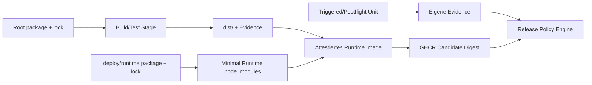

# Runtime Dependency Boundary

> **Status:** Architektur- und Supply-Chain-Vertrag · 2026-10-01  
> **Domains:** CAPITAL-AI-PLATFORM / CAPITAL-AI-TRUST  
> **Basis:** `main@2008cac17c8cabc98576d6b20a1ad56048c0028f`

## Inhaltsverzeichnis

- [Ziel](#ziel)
- [Execution Units](#execution-units)
- [Aktueller Schnitt](#aktueller-schnitt)
- [Supply-Chain-Regeln](#supply-chain-regeln)
- [Triggered und Postflight](#triggered-und-postflight)
- [Dependency-Update-Policy](#dependency-update-policy)
- [Dokumentationswerkzeuge](#dokumentationswerkzeuge)
- [Abnahme](#abnahme)

## Ziel

Das produktive Webservice-Image soll nur die Node-Abhängigkeiten enthalten, die der dauerhaft laufende Server tatsächlich benötigt. Build- und Frontend-Werkzeuge bleiben im Build-Stage; ad-hoc/postflight Fähigkeiten werden als getrennte Execution Units modelliert.

## Execution Units

| Scope | Beispiele | Im finalen Webservice-Image |
|---|---|---|
| Build | Vite, TypeScript, React-Bundle, Lizenzgenerator | Nein |
| Runtime | NATS, Valkey/Redis, Zod-Verträge, JOSE/OIDC | Ja |
| Triggered/Postflight | Scans, Benchmarks, Reports, spätere Mail-/Migrationsjobs | Nur als eigene Unit |
| Evidence | SBOM, Attestations, Reports | Referenziert, nicht als Toolchain bevorratet |

## Aktueller Schnitt

`deploy/runtime/package.json` und sein Lockfile bilden die minimale Server-Closure. Der Docker-`production-deps`-Stage installiert diese Closure separat mit `npm ci --omit=dev --ignore-scripts`. Dadurch werden Frontend-/Build-Abhängigkeiten nicht mehr über ein Root-`npm prune` in das finale Image getragen.

Aktuell direkt runtime-erforderlich sind:

- `@nats-io/jetstream`
- `@nats-io/transport-node`
- `redis`
- `zod`
- `jose`

Nodemailer bleibt im Root-Build-/Lizenzbestand, wird aber nicht in das Runtime-Image aufgenommen, solange kein produktiver Mail-Ausführungspfad es importiert. Dasselbe Prinzip gilt für geplante Express-/FastAPI-/Worker-Komponenten: erst der geprüfte ausführbare Pfad rechtfertigt die Runtime-Aufnahme.

## Supply-Chain-Regeln

1. Jede Execution Unit besitzt ein eigenes, deterministisches Manifest/Lockfile.
2. Alle Lockfiles bleiben CVE-, Lizenz-, Provenance- und Update-sichtbar.
3. Runtime-Minimierung darf Scanner-Evidence nicht durch Weglassen „grün machen“.
4. Neue Runtime-Abhängigkeiten benötigen Reachability-Nachweis und Security-/License-Review.
5. Triggered Units bekommen Least Privilege, bounded Netzwerk/Secrets/Timeouts und eigene Evidence.
6. Das attestierte Candidate-Image wird nach dem Build nicht durch Postflight-Jobs mutiert.

## Triggered und Postflight

Ad-hoc-Funktionen sollen über explizite Jobs/Worker/Queues oder manuelle, autorisierte Workflows laufen. Ein Trigger ist kein Mechanismus, um Production-Gates zu umgehen. Für SMTP, Datenmigration, Benchmarks oder Compliance-Reports wird deshalb jeweils eine eigene Execution Unit bevorzugt, sobald der konkrete Codepfad implementiert ist.

## Dependency-Update-Policy

Der frühere Branch `capital-ai-trust/dependency-update-policy-20261001` war gegenüber aktuellem Main **1 Commit voraus und 4 Commits zurück**. Seine sinnvolle Änderung wurde deshalb nicht rebased/überschrieben, sondern auf diesem frischen Current-Main-Branch rekonstruiert:

- Routine Minor/Patch gruppieren.
- Security Minor/Patch gruppieren.
- Major-Upgrades einzeln als Migration behandeln.
- npm-Donor-Patches einzeln halten, weil Hardener, Integrität und Regression Evidence gekoppelt sind.

## Dokumentationswerkzeuge

GitHub-native Markdown-/Mermaid-Darstellung ist Standard. Sie benötigt keine zusätzliche schreibende Drittanbieter-Action.

Marketplace-Kandidaten wurden nur als Optionen betrachtet:

| Kandidat | Nutzen | Trust-Auswirkung | Entscheidung |
|---|---|---|---|
| TOC Generator | TOC automatisch committen | Drittanbieter-Action + Write-Token/PAT möglich | vorerst nicht integrieren |
| Generate Mermaid Diagrams | Mermaid nach SVG rendern | mehrere Actions/Container + Contents Write | vorerst nicht integrieren |
| auto-doc | Workflow-/Action-Tabellen erzeugen | zusätzliche Action-Supply-Chain | nur bei echtem Bedarf benchmarken |

Native Darstellung reduziert Berechtigungen, CI-Kosten und Supply-Chain-Fläche. Ein Marketplace-Tool kann später über CADS aufgenommen werden, wenn ein konkreter Mehrwert gegenüber GitHub-native belegt ist.

## Abnahme

Vor Merge müssen mindestens bestätigt sein:

- `npm ci` für das Root-Lockfile bleibt reproduzierbar.
- `npm ci --omit=dev` für `deploy/runtime` ist reproduzierbar.
- Server-/Infrastructure-Regressionstests laufen mit der minimalen Runtime-Closure.
- Docker Security Gate scannt weiterhin Source, Build und finales Image.
- Runtime-SBOM enthält die tatsächliche minimale Closure.
- Keine Build-/Frontend-Dependency wird versehentlich als Runtime-Voraussetzung benötigt.
- Production-Handoff bleibt separat und fail-closed.
