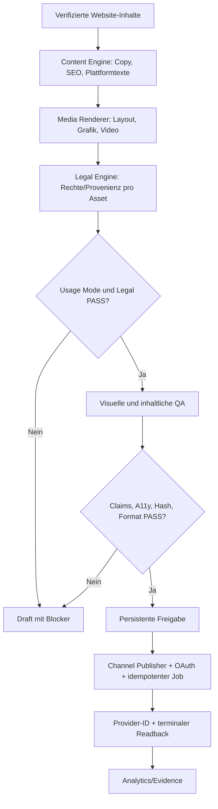

# CAPITAL AI — Eigenständige Social Media Engine und Dual-Use Content Pipeline

Status: IMPLEMENTATION_BLUEPRINT / END_TO_END_NOT_PROVEN  
Stand: 2026-10-09  
Domain: GROWTH mit PRODUCT, TRUST und PLATFORM

## Verbindliche Grenzen

1. Social Media Engine, Renderer, OAuth, Scheduler, Persistenz, Analytics und Publisher werden ausschließlich aus `SvenKulessa/Capital-AI` betrieben. `capital-ai-online/Finance` darf weder zur Build- noch zur Runtime- oder Publication-Abhängigkeit werden. Finance dient ausschließlich als historischer, read-only Migrationsbeleg.
2. Die Engine unterstützt zwei technisch isolierte Verwendungsmodi: `PRIVATE_PERSONAL` und `COMMERCIAL`. Rechte werden je Tool, Modell/Weights, Input, Font, Bild, Video, Musik, Codec, Output, Provider und Channel geprüft.
3. Kein Sharing privater Nutzer-Assets, BYOK-Keys oder privater Ergebnisse in kommerzielle/public Caches. Eine spätere kommerzielle Wiederverwendung eines privaten Outputs verlangt eine neue vollständige Rechte- und Provenienzprüfung.
4. Jeder veröffentlichungsreife Blog-Post enthält überprüfte Website-/Quellen-Claims, professionelle kanalbezogene Copy, mindestens ein tatsächlich gerendertes und visuell geprüftes grafisches Asset sowie eine referenzierte Rechtefreigabe. Ein Bildkonzept allein genügt nicht.
5. Publikation nur mit authentifizierter Owner-/Channel-Authority, unveränderlichem Asset-Hash, idempotentem persistentem Job, echtem Provider-Resultat und terminalem Readback. `scheduled` oder `uploaded` sind nicht `PUBLISHED`.

## Read-only Code-Evidence aus main am 2026-10-09

- `CAPITAL-AI-GROWTH/social-engine-completion-gate.json`: 21/21 Runtime-Dateipfade, 2/2 Rendererpfade und 12/12 Evidence-Pfade im Ziel erfasst; **Status ausdrücklich BLOCKED**, nicht vollständig abgenommen.
- `src/contracts/socialPublisherAdapter.ts`: YOUTUBE, TIKTOK, INSTAGRAM, X, FACEBOOK = `IMPLEMENTED_DISABLED`. Kein Plattform-Write aus Dateipräsenz ableiten.
- `src/platform/SocialMediaEngine/Publishing/MediaProjectPublisherBridge.ts`: typisierte Identity-/Freigabegrenze; keine Provider-Write-Authority.
- `CAPITAL-AI-GROWTH/SOCIAL-ENGINE-MIGRATION.md`: historischer Finance-basierter Quellstand, Migrationslücken und zulässiges eigenständiges Zielbild. Kein Beleg für aktive Finance-Bridge, aber auch kein vollständiger Negativtest.

## Zielarchitektur



Der Pipeline-Code läuft in CAPITAL AI. Finance ist **nicht** Bestandteil des Diagramms oder des operativen Runtime-Flusses.

## Vertrag

```typescript
type UsageMode = 'PRIVATE_PERSONAL' | 'COMMERCIAL';
type RightsState = 'VERIFIED' | 'RESTRICTED' | 'UNKNOWN' | 'DENIED';

type LicensedAsset = {
  assetId: string;
  sha256: string;
  mimeType: string;
  sourceRef: string;
  generator: { tool: string; version: string | null; termsRef: string };
  license: { state: RightsState; evidenceRef: string; commercialAllowed: boolean; attribution?: string };
  visualQaRef: string | null;
};

type EditorialPackage = {
  schema: 'CAPITAL_AI_EDITORIAL_PACKAGE@1';
  usageMode: UsageMode;
  contentId: string;
  sourceSha: string;
  claimsEvidenceRefs: string[];
  seo: { title: string; description: string; canonicalUrl: string | null };
  captions: Record<string, string>;
  assets: LicensedAsset[];
  publicationState: 'DRAFT' | 'REVIEWED' | 'QUEUED' | 'PUBLISHED' | 'FAILED' | 'UNKNOWN';
};
```

Commercial mode muss technisch **fail-closed** prüfen: unbekannte und private-only Lizenzen sind keine kommerzielle Erlaubnis. Auch frei lizenzierter Code kann mit nichtkommerziellen Gewichten/Inputs kombiniert sein. Weiterhin anwendbar sind providerseitige Tarif-, Account-, Posting- und Datennutzungsbedingungen. Kein implizites Rechte-Laundering beim Rendern/Exportieren.

## Qualitätskriterien pro Lauf

- Redaktion: keine duplizierten Beiträge; überprüfte Claims und Datumsangaben, verständlicher CTA, finanzbezogene Kennzeichnung.
- Visuals: echte Bild-/Videobytes, Hash, Licence-Receipt, markenkonformer Satz, lesbare Typografie, passende kanalbezogene Crops/Safe Areas, Screenreader-/Alt-Text und Mobile-Prüfung.
- Software: typisierte Schemas, deterministische Validierung und isolierte Mode-Permissions, Tests für Negativpfade und Race/Retry/UNKNOWN.
- Operations: CPU-/GPU-Kosten und Lizenz des tatsächlichen Render-Stacks prüfen; keine neuen kostenpflichtigen Aktivierungen ohne Owner-Beschluss.

## Migrations- und Abnahmetests

1. `Finance` offline/unzugänglich: sämtliche benötigten Social-Runtimepfade und Renderer im Ziel laufen oder scheitern lokal erklärbar, ohne eine Finance-Verbindung.
2. Source-to-target-Modulliste und Importe vollständig abgleichen; nur historische Finance-Referenzen in Migrationsdokumentation zulassen.
3. Private-only-Tool im `COMMERCIAL`-Modus muss vor Rendering und Publish scheitern; private Outputs bleiben tenant-isoliert.
4. Lizenz- und Rechte-/Claim-Fehler führen zu `DRAFT`, niemals zu `PUBLISHED`.
5. Website-Blog und Social-Medien nur mit tatsächlichem gerenderten grafischen Asset als `PUBLISH_READY`.
6. Provider-Status `UNKNOWN` verhindert ungeprüfte Wiederholung; doppelte Delivery Keys erzeugen keine Doppelposts.
7. Veröffentlichung mit echtem Provider-Post-ID-/URL-Readback nachweisen. Kein Simulationsergebnis als Echtpublikation.

## Priorisierte Umsetzung

P0: Finance-Unabhängigkeit und Modulkatalog als Laufzeittest nachweisen; `social-engine-completion-gate.json` bleibt BLOCKED bis zur Evidence.  
P1: `usageMode`-Policy als serverseitiges Zod-/Runtime-Gate implementieren, mit isolierten Credential-/Cache-Namensräumen und Negativtests.  
P1: Legal-/Lizenz-Engine für jedes tatsächliche Output-Asset vor Rendering und vor Publishing binden.  
P1: Grafik-/Layout-Quality-Gate in den Content-Workflow einbauen; bestehende Renderer vor neuer OSS-Dependency bevorzugen.  
P2: Zugelassene Publisher einzeln verbinden, echten Readback beweisen und erst dann autonome Distribution aktivieren.

**Status:** Dies ist ein technischer, versionierter Arbeitsplan; er erzeugt weder eine Social-Veröffentlichung noch eine Runtime-Freischaltung oder externe Lizenz.
