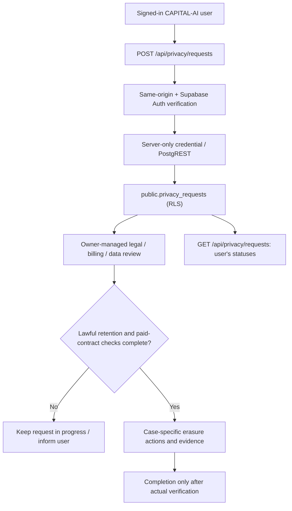

# CAPITAL-AI · Controlled account-erasure request lifecycle

Stand: 2026-10-10 · Primary domain: PLATFORM · Linked: TRUST / PRODUCT
Authority: `AGENTS.md` (`SOLO_MAINTAINER_FLOW@1`)

## Scope and production boundaries

The existing `/datenschutz` privacy-rights form previously produced a `mailto:` draft
even though `public.privacy_requests` already exists in Supabase. An authenticated
submission is now persisted through the server-only Supabase service credential, and
the user can read their own request receipts/statuses. An anonymous visitor still
uses the clearly labeled email path.

This is **request intake and tracked managed review**. It is **not** automatic
account deletion, Stripe cancellation, provider revocation, database purge, or
an assertion that a request has been fulfilled. The application must never return
`completed` merely because a request was submitted.

## Data and trust flow



- The browser supplies **no** user ID; the server obtains it from `auth.verify()`.
- `POST` requires same-origin. Both `GET` and `POST` verify the live Auth session.
- The Supabase secret and request text are never returned. Only receipt metadata is exposed.
- RLS is already enabled. `authenticated` has no direct INSERT grant; `service_role`
  does. The API queries by verified `user_id` on every read.
- Existing open requests of the same type are reused sequentially. Concurrent
  deduplication is best-effort until a case-specific uniqueness constraint is added;
  this is not an exactly-once transactional guarantee.
- When Supabase is unavailable, return 503; never claim successful submission or
  silently fall back to an unsent email draft.
- No new paid resource, OAuth provider, queue, worker, or database schema change.

## Owner-managed account erasure (never blind-delete)

1. Authenticate the requester and compare the request receipt to the verified account.
   Review whether the request needs enhanced identity confirmation; the request alone
   does not authorize a destructive operation.
2. Read `public.subscriptions` and the authoritative **Stripe-side** billing/customer
   state. Active/trialing contracts require documented cancellation/offboarding decisions;
   a local `free` tier does not prove that Stripe has no active billing obligation.
3. Check retention exceptions for financial transaction, legal, AML/abuse, security,
   support and audit evidence. Separate lawfully retained proof from erasable profile
   and private provider data. Determine purpose and minimum retention by applicable law
   and contract, not by an arbitrary global setting.
4. Inventory affected user-owned rows, object storage, social/provider tokens, vault
   secret references, NATS/Valkey per-user ephemeral data and external providers.
   Revoke access where permitted and prevent retry-based repopulation. Never publish
   BYOK results through public event/cache channels.
5. Account for existing restrictive FKs. `public.subscriptions.user_id` and
   `public.audit_logs_iam.actor_user_id/target_user_id` reference `auth.users`
   with NO ACTION. **Do not** disable constraints, cascade audit data or delete
   subscriptions as a substitute for Stripe cancellation.
6. Before an eventual Auth user deletion, preserve the minimum lawful, access-controlled
   completion receipt independently: `public.privacy_requests.user_id` currently has
   ON DELETE CASCADE, so deleting `auth.users` would also remove its request record.
   An approved durable evidence/retention implementation is necessary to complete
   physical deletion safely. A user erasure is not operationally READY until that
   requirement and all restrictive FKs are handled.
7. Transition `received -> identity_verified -> in_progress -> completed/rejected`
   only after the relevant manual checks/actions. Communicate any refusal or
   retention exception appropriately. Never mark `completed` solely on an attempted
   Auth Admin API operation.

## Non-destructive operator queries

```sql
-- No user IDs, secrets, or request text are returned.
SELECT request_type, status, count(*) AS requests
FROM public.privacy_requests
GROUP BY request_type, status ORDER BY 1,2;

SELECT con.conname,
       con.conrelid::regclass::text AS source_table,
       pg_get_constraintdef(con.oid) AS definition
FROM pg_constraint con
WHERE con.contype = 'f' AND con.confrelid = 'auth.users'::regclass
ORDER BY 2,1;

SELECT status, count(*) AS subscriptions
FROM public.subscriptions
GROUP BY status ORDER BY status;
```

For a specific verified case, only an authorized operator should access request
details or change statuses through the existing restricted Supabase administrative
path. Never paste subject UUIDs or request text into publicly shared CI logs/issues.

## Rollback and verification

Rollback code through a revert PR and its normal `main` deployment. Existing
request rows remain intact and must continue receiving lawful handling even
if the UI intake is reverted. This feature performs no destructive database
mutations and requires no NATS deployment.

- `node --test server/auth.test.mjs` must cover same-origin, invalid input,
  persisted receipt, own-history readback, duplicate submitted request and 503
  on unavailable storage.
- `npm run lint` and repository Required Checks run in GitHub Actions.
- Post-merge production checks: authenticated submission into an isolated test
  account, persisted DB receipt readback, own-user history, cross-user denial,
  no Stripe-side mutation, no provider credential exposure.
- Do not create a live erasure request for a real customer just to test it.

**Evidence states:** intake CODE_PRESENT pending CI; request persistence
RUNTIME_NOT_PROVEN until post-merge test; actual identity deletion BLOCKED until
case-specific retention, FK and provider processing is implemented and validated.
