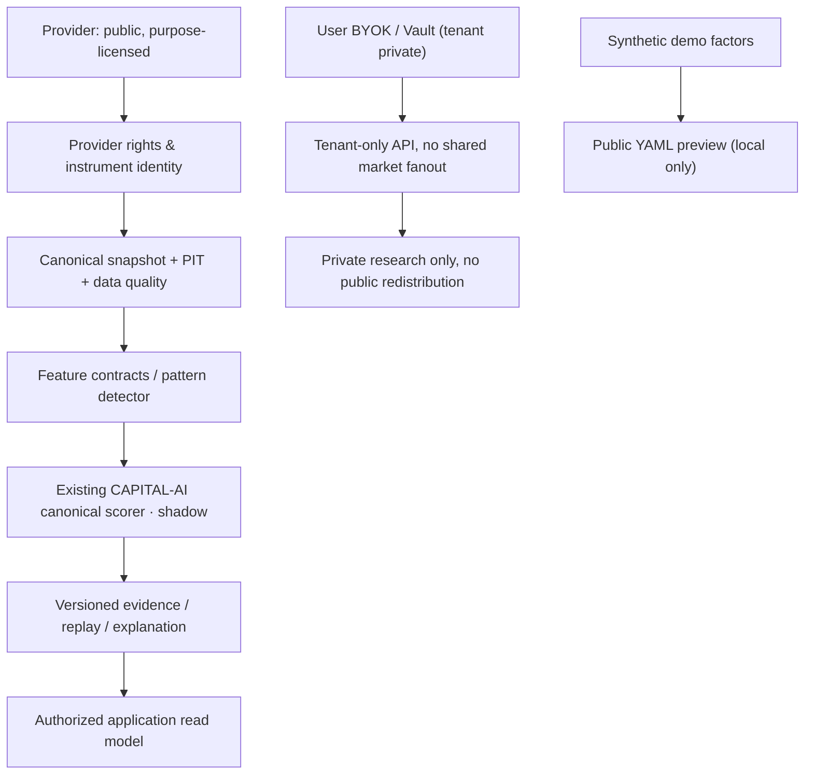

# CAPITAL-AI Screener Blueprint Bundle v0.1 — product and security contract

**Decision (2026-10-09):** Product variant A — one combined **Data Concept + Scoring/Pattern Playbooks** bundle.
The first editor is a **YAML preview with an architecture diagram**; drag-and-drop Studio is a later optional upgrade.

**Scope:** `SvenKulessa/Capital-AI` PR #340. Source document is private Drive
`EnterpriseScorer_Blueprint_v1.pdf` / ARCH-SCREEN-0002. This public
document **does not reproduce the private source or licensed buyer files**.

## Product boundary

- **Public:** non-purchasable marketing preview, original branded badge, bounded synthetic YAML snippet,
  factor chart and schematic trust-boundary diagram.
- **Private paid product (NOT_ENABLED):** combined architecture playbook, tool-specific score models,
  reproducible TypeScript/reference tests, YAML schema, detailed implementation guide,
  pattern feature contracts and licensed customer deliverables.
- **Upgrade (PLANNED):** React/TypeScript diagram composer that edits a versioned model,
  produces validated YAML and enforces server-side customer entitlement when opening paid artifacts.
- **Commerce:** no new Stripe SKU, price, coupon, checkout endpoint or entitlement created in this PR.
  `src/data/blueprintDeliveryPolicy.ts` remains fail-closed (`currentCommerceAdmission: false`).

## Reference architecture

No second production scoring authority is created. Incoming pattern evidence must
have an independent feature identifier, timeframe, confirm/reject timestamps,
source rights, version and point-in-time identity; overlapping momentum/technical
observations must not count twice without a validated aggregation model.
Risk vetoes, missing data and confidence must continue to use the canonical
scoring gate rather than simplified public demo weights.

## Reference factor example (NOT calibrated)

`fundamental .22 · technical .18 · momentum .14 · liquidity .16 · risk_quality .15 · patterns .15`

With **synthetic** signals 80/70/75/90/60/85 yields **76.85/100**.
This is neither a backtest, live score, trading decision, expected return,
validated model, public data rights claim nor representative product performance.

The browser preview **only** accepts the fixed demo model identifiers,
six numeric weights (sum = 1) and six numeric example signals (range 0..100).
Strict 2 KiB input bound; unknown YAML tags, anchors, objects, additional keys
or `mode: live` are rejected. No network request, localStorage persistence,
provider key entry, external parser or API-key access is necessary.

## Private buyer delivery contract (NOT_ENABLED)

1. Authenticated user identity from server-verified session; never trust `user_id` from the client.
2. Stripe payment must be reconciled via verified webhook with existing paid projection / idempotency.
3. Single stable bundle SKU and real effective entitlement for the correct tenant.
4. Private object storage (no `public/`, Git-tracked paid files, or anonymous bucket grants).
5. Server-side authorized read; downloadable object bound to that user/tenant and specific
   product/version, with short expiry and no public shared caching.
6. Verify object digest, rights provenance and permitted license scope before issuance.
7. Prevent directory traversal, cross-tenant object access, token replay,
   URL disclosure in logs, and secrets in zip/metadata. Download audits should avoid content leakage.
8. Fail closed on missing evidence, auth, SKU, rights, storage or webhook state.
9. Customer license must **not** include underlying provider market-data, model weights,
   trademarks, proprietary patterns from third parties or universal resale rights without ownership evidence.

## Current test/evidence boundaries

- Static checks and pure synthetic computation are **technical demo-only** evidence.
- `Docker Security Gate` and `Domain Governance` are the only existing repository required checks
  under `AGENTS.md`; do not create a new governance gate from this document.
- Website browser, mobile, keyboard/screenreader checks, production performance,
  commercial provider permissions, customer license, real Stripe purchase chain
  and private object delivery are **NOT_PROVEN**.
- Production release requires the independent rights/security/runtime scope evidence actually applicable
  to this product, not a categorical BaFin or MiCA certification claim.

## Security assumptions / costs

No new paid subscription, API calls, separate worker, cloud service,
bucket or license purchase is activated by this PR. The existing
CI build and frontend deployment consume existing quotas; actual remaining
quota and overage charges are NOT_PROVEN.

## Implementation playbook

1. Validate per-source commercial purpose, output/derivative, retention and public-redistribution rights.
2. Resolve canonical instrument identity and bitemporal feature source events.
3. Add pattern feature adapters to the existing scorer under shadow mode, preserving the
   current 0.90 minimum confidence contract and hard eligibility gates.
4. Test absence, duplicates, staleness, lookahead, negative pattern confirmations,
   double counting and deterministic replay.
5. Collect out-of-sample walk-forward and category-specific calibration evidence
   before enabling any ranking/public score.
6. Add a real customer product only after explicit Owner SKU/pricing/license decisions,
   authorized private storage and purchase-to-entitlement-to-download E2E.
7. Extend the public Content/Social copy only with `DEMO_ONLY` or verified claims;
   publishing requires its already-defined provider approval workflow.

**Branch:** `capital-ai-trust/screener-blueprint-preview-20261009`  
**PR:** `[CAPITAL-AI-TRUST] Screener Blueprint Preview, Badge und sichere Lizenzgrenzen`

## Owner brief V2 — target groups and editorial product surface (2026-10-09)

New private Drive file ID: `1TajuS81rWoAfDakv255b9DL9gu8rxpw7` (not distributed publicly). The file expands audience segmentation, product messaging, website CTAs, data/source concepts, a pattern intraday layer and tool playbooks. Its proposed independent products remain **future options**. Approved A remains the combined product with YAML-only preview and later optional visual Studio upgrade.

- Target audiences: FinTech/Quant builders, Research teams, Screener developers, and agencies/Legacy integrators.
- Product marketing preview: `src/features/documentation/ScreenerBlueprintAudienceSection.tsx`.
- Brand badges: `screener-data-blueprint.svg`, `screener-scoring-blueprint.svg`, `screener-bundle-blueprint.svg`; reproducible manifest and SocialMediaEngine offline source in `docs/licenses/screener-blueprint-badges.manifest.json`.
- Social/channel drafts: `src/data/contentCampaigns.ts` and `docs/growth/SCREENER-BUNDLE-CAMPAIGN-V2-20261009.md`.
- Product feedback and official industry-update evidence: `src/platform/SocialMediaEngine/Learning/FeedbackLearningLoop.mjs` provides **CANDIDATE_ONLY** classifications. Input feeds and user analytics are NOT_PROVEN; it neither trains a model nor publishes content.
- Security correction: V2 example's `min_confidence=0.65` cannot relax the existing CAPITAL-AI canonical shadow `minimumConfidence>=0.90` contract. Other source provider names and endpoints are conceptual, not license grants.
- No paid SKU, tenant entitlement, customer download, production score or automatic publishing is activated.
